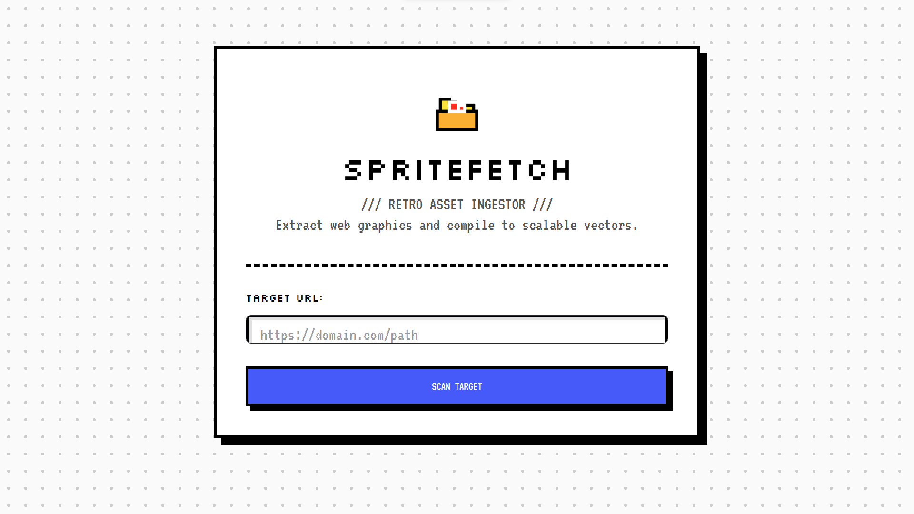

<p align="center">
  
</p>

# SpriteFetch

Fetch images from web pages and convert them into SVG files.

## Web Interface Preview

Use this template to place a screenshot of the web interface in the README:

```html
<p align="center">
  
</p>
```

Replace `docs/ui-preview.png` with your actual screenshot path.

## Requirements

- Python 3.10+
- `streamlit`
- `cloudscraper`
- `beautifulsoup4`
- `Pillow`
- `requests`

Install everything with:

```bash
pip install -r requirements.txt
```

## Quickstart

Install the dependencies first, then launch the app:

```bash
pip install -r requirements.txt
streamlit run app.py
```

## Features

- Scan a target URL for images
- Preview and select assets to convert
- Convert selected images into SVG

## Usage

1. Open the app in your browser.
2. Enter the target page URL in the `TARGET URL` field.
3. Click `SCAN TARGET`.
4. Preview the assets, select the ones you want, then click `PROCESS SELECTED`.

## Production Readiness

- **Status:** usable for local and internal workflows.
- **Strengths:** simple setup, clear UI flow, and direct SVG export.
- **Current gaps:** no automated test suite, limited validation for edge cases, and no deployment pipeline.
- **Recommended next steps:** add integration tests, stronger error handling, rate-limit protection, and a deployment target.

## Notes

- Make sure the target URL is valid and that the website allows asset scraping.
- SVG output is stored in the `downloads/` folder.
- For public deployment, review scraping policy, add authentication if needed, and confirm the target environment can handle file writes.

## License

This project is licensed under the MIT License — see the [LICENSE](LICENSE) file for details.

## Releases

### v0.1 — Initial release (2026-05-17)

- **Summary:** Initial public release.
- **Tag:** [v0.1](https://github.com/Pashinoh/SpriteFetch/releases/tag/v0.1)
- **Logo:** [assets/logo.svg](assets/logo.svg)