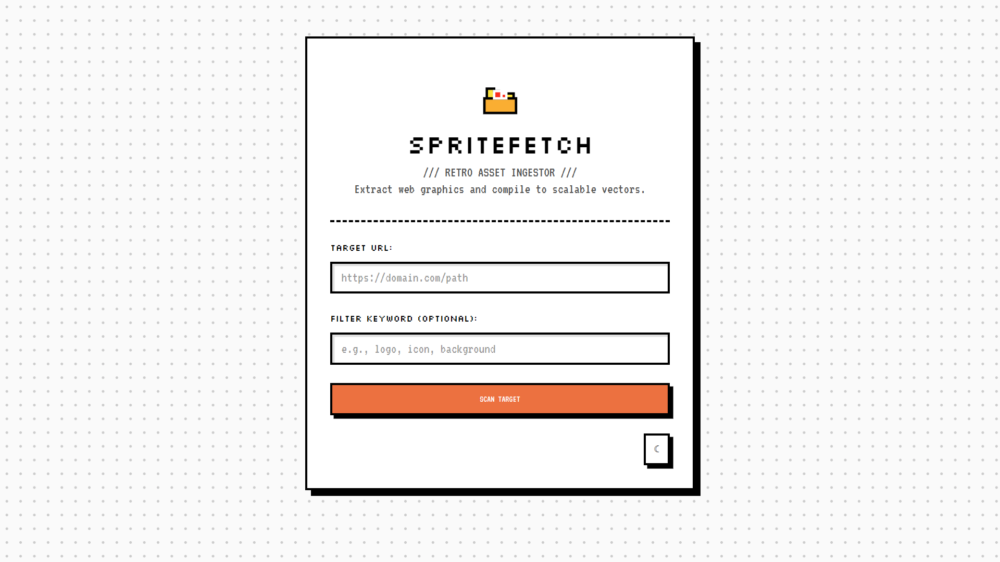
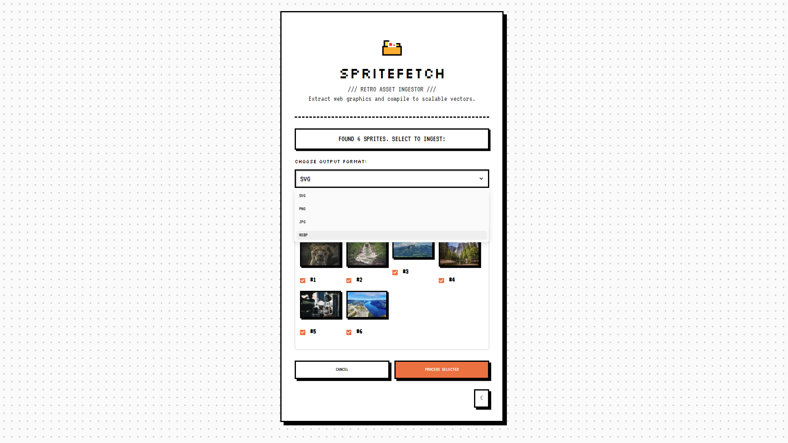
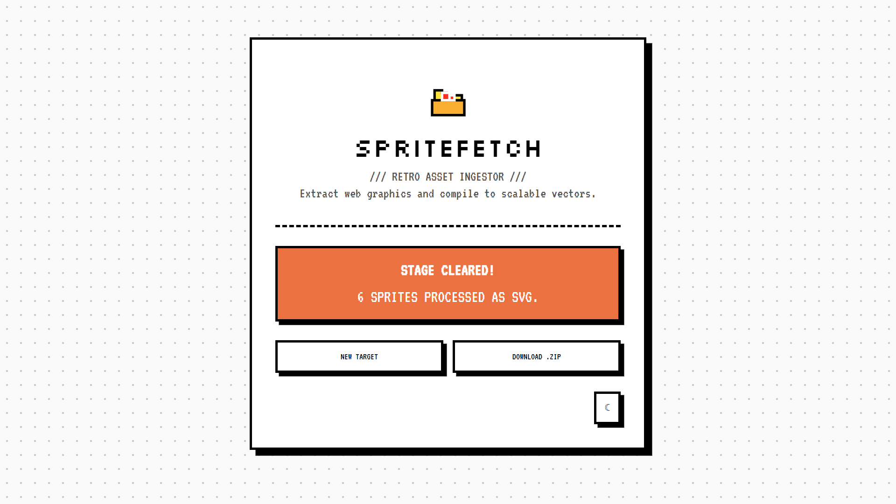

<p align="center">
  
</p>

# SpriteFetch

SpriteFetch scans web pages for images, lets you preview/select assets, and exports them in multiple formats (SVG, PNG, JPG, WEBP) for easy download and reuse.
<p>
  
  
  
  
  
  
</p>

<p align="center">
   
</p>
<table align="center">
   <tr>
      <td align="center">
         
      </td>
      <td align="center">
         
      </td>
   </tr>
</table>

The images above show the current UI preview for the app.

## Quickstart

Install the dependencies first, then launch the app:

```bash
pip install -r requirements.txt
streamlit run app.py
```

## Local virtual environment

Create and activate a local virtual environment before installing dependencies:

```bash
python -m venv .venv
# macOS / Linux
source .venv/bin/activate
# Windows (PowerShell)
.venv\\Scripts\\Activate.ps1
# Install dependencies inside the venv
pip install -r requirements.txt
```

Note: Do not commit the `.venv` directory to the repository. Keep it local and add it to `.gitignore` if needed.

## Features

- **Web Scraping**: Scan target URLs for all images including lazy-loaded assets
- **Asset Preview & Selection**: Interactive grid preview with bulk select/deselect options
- **Multi-Format Conversion**: Convert images to SVG, PNG, JPG, or WEBP formats
- **Batch Processing**: Convert multiple assets at once with ZIP bundling
- **Smart Filtering**: Optional keyword filtering to narrow down asset search
- **Cloudflare Bypass**: Automatic detection and bypass of Cloudflare protection

## Usage

1. **Launch the Application**:
   - Open the app in your browser after running `streamlit run app.py`

2. **Scan Target**:
   - Enter the target page URL in the `TARGET URL` field
   - Optionally, add a comma-separated keyword filter (e.g., `logo, icon, background`) to narrow down results
   - Click `SCAN TARGET` to fetch and preview all images

3. **Select Assets**:
   - Preview images in an interactive grid
   - Use the `SELECT / DESELECT ALL ASSETS` checkbox for quick bulk selection
   - Individually check/uncheck specific assets
   - Choose your desired output format (SVG, PNG, JPG, WEBP)

4. **Process & Download**:
   - Click `PROCESS SELECTED` to convert assets
   - Single images download directly
   - Multiple images are bundled into a ZIP file
   - Click `DOWNLOAD ASSET` or `DOWNLOAD .ZIP` to save

## Notes

- **Valid URLs Required**: Ensure the target URL is valid and publicly accessible
- **Scraping Compliance**: Respect website terms of service and robots.txt policies
- **Output Storage**: Downloaded files are stored in the `downloads/` folder
- **Authentication**: For protected websites, consider adding custom headers or authentication cookies if needed
- **Performance**: Large image collections may take time to process; be patient during the scanning and conversion phases

## License

This project is licensed under the MIT License — see the [LICENSE](LICENSE) file for details.